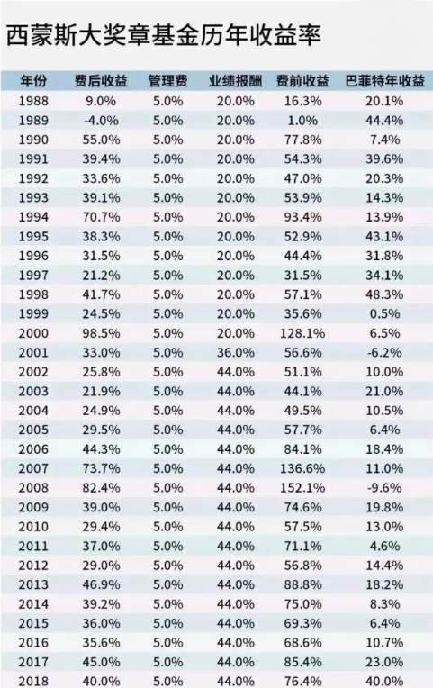

# 百亿华尔街投资总监推荐的量化投资经典书籍

## 前言

一直有人找我推荐量化投资的经典书籍，刚好我合作的管理过百亿规模的华尔街资深投资总监最近推荐了一些量化投资的经典书籍。

这些书我之前刚好都看过，的确很不错，就借这篇文章推荐给大家。

希望获取书籍的可以关注我的vx公号，发送消息`量化书籍`获取书籍下载链接。

## 入门书籍

* A Man for All Markets: From Las Vegas to Wall Street, How I Beat the Dealer and the Market

这本书的作者是Edward O. Thorp，他有多重身份：数学教授、世界级二十一点(blackjack)玩家、量化对冲基金经理、畅销书作家。

这本书讲述了作者本人是如何从战胜拉斯维加斯的赌场到创办量化对冲基金打败金融市场。

* The Man Who Solved the Market: How Jim Simons Launched the Quant Revolution

这本书里讲述的人是量化投资之父：西蒙斯。

西蒙斯在数学家和投资家之间随意游走，带领一帮数学家、物理学家和计算机工程师用数学和计算机模型打败了金融市场。

其创立的文艺复兴对冲基金公司时至今日仍然是全球最顶级的量化对冲基金公司。

文艺复兴的大奖章基金理念收益率更是可怕，可以吊打巴菲特。

 

通过这本书，你可以了解到西蒙斯是如何从数学家走向投资家，如何用量化投资战胜市场，征服华尔街。

* The Quants: How a New Breed of Math Whizzes Conquered Wall Street and Nearly Destroyed It

这本书的中文名叫《宽客》，相信听说或者看过的人不少。

这本书讲述了众多知名的quant是如何用数学模型和计算机去征服华尔街，让你对美国量化投资以及知名基金经理有一个清晰的认知。

* When Genius Failed: The Rise and Fall of Long-term Capital Management

这本书讲述了Long-term Capital Management这家量化对冲基金公司的崛起和陨落。

这家公司的两个创始人，一个是美联储前副主席，一个是华尔街量化对冲套利高手。

公司1993年成立，最高峰管理超过1000亿美元，1998年倒闭。

看这本书的意义在于，我们要了解量化投资的优势和可能的缺点，学会控制风险。

## 实战书籍

* Inside the Black Box: The Simple Truth about Quantitative Trading

作者是Rishi K. Narang，华尔街量化投资专家，资深量化对冲基金经理。

这本书剖析了量化投资的全流程，从数据、研究、alpha模型、风险模型、投资组合构建、交易执行等方方面面做了一个介绍。

这本书对想入门量化投资，或者已经从事量化投资的人都有一定帮助。

* Finding Alphas: A Quantitative Approach to Building Trading Strategies

这本书的作者是大名鼎鼎的WorldQuant的创始人Igor Tulchinsky及其研究团队。

虽然WorldQuant有一些争议，但不可否认量化投资行业很多人借鉴WorldQuant的多因子挖掘方式，形成了有效的量化投资框架，在二级市场也取得了不错的成绩。

这本书讲述了如何寻找Alpha所需的数据、如何做回测、Alpha因子和风险因子、如何避免过拟合等等。

* Calculated Bets: Computers, Gambling and Mathematical Modeling to Win

这本书的作者Steven S. Skiena是一名计算机科学家，他写的算法设计一书成为众多大学的教材。

在这本书里，作者讲述了如何基于数学模型和计算机程序来做预测，将这些模型应用于乐透、轮盘赌、21点和华尔街。

适合理工科背景的人士阅读。

* Active Portfolio Management: A Quantitative Approach for Producing Superior Returns and Controlling Risk

这本书的两位作者Richard Grinold / Ronald Kahn都是巴克莱全球投资公司的董事总经理。

这本书比较偏学术和理论一些，也是一些大学的教材。

作者在这本书里介绍了如何基于量化的方式来构建、回测和评估你的投资组合，并且控制好风险。

## 总结

后续看到了不错的量化投资书籍，也会持续更新推荐给大家，欢迎大家保持关注。

希望获取书籍的可以关注我的vx公号，发送消息`量化书籍`获取书籍下载链接。

## 开源地址

文章和示例代码开源在GitHub，想学习量化投资的可以保持关注。

* [量化交易业务知识体系](https://github.com/jincheng9/finance_tutorial)
* [量化交易Python技术栈](https://github.com/jincheng9/python-tutorial)

公众号：coding进阶。关注公众号可以获取量化交易最新业务知识和技术栈。

个人网站：[Jincheng's Blog](https://jincheng9.github.io/)。

知乎：[无忌](https://www.zhihu.com/people/thucuhkwuji)。