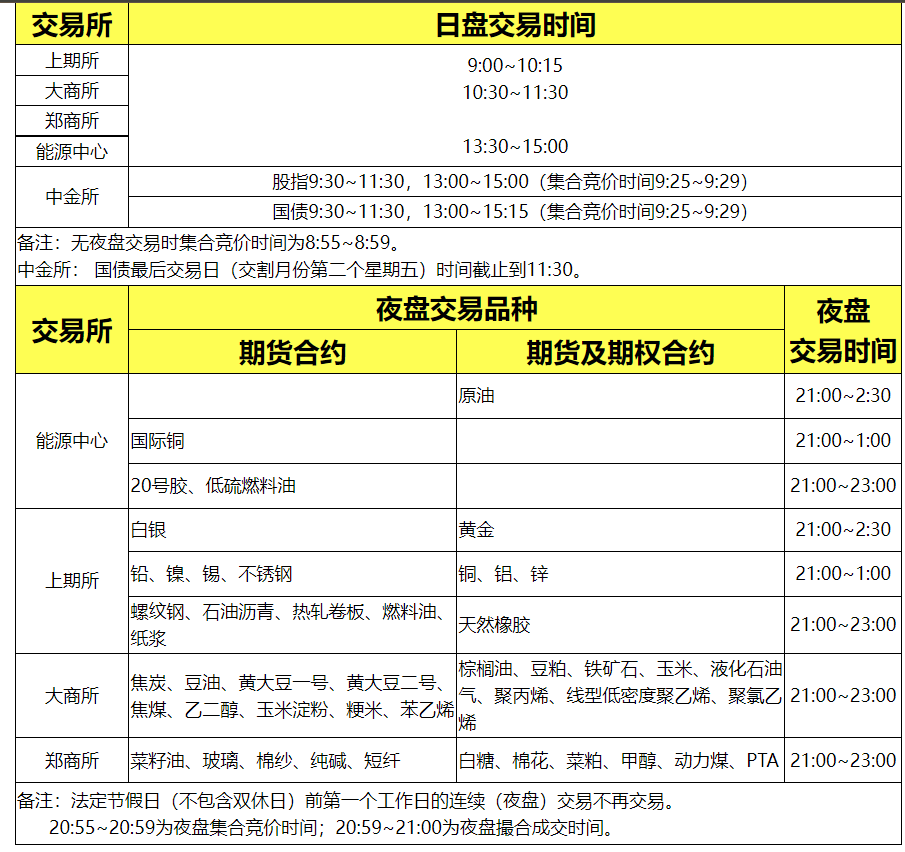

# 各个期货交易所的交易时间

我国目前存在四家期货交易所和一家交易中心：

* 上海期货交易所
* 大连商品交易所
* 郑州商品交易所
* 中国金融期货交易所
* 上海国际能源交易中心

交易日为每周一至周五，交易日具体交易时间如下表（如遇国家节假日休盘，具体交易时间见交易所实时通知）

## References

* 金信期货：https://www.jinxinqh.com/article/205
* 银河期货：https://www.yhqh.com.cn/list-901-1.html