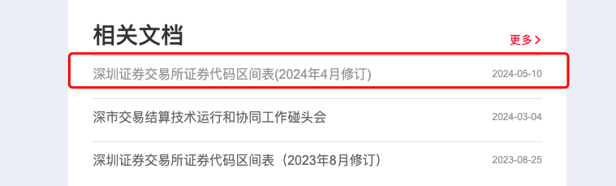

# 交易所证券代码段分配规则

## 上交所

证券代码是指上海证券交易所（以下简称本所）用于证券交易及非交易业务的数字编码。本所证券代码采用6位阿拉伯数字编码，取值范围为000000-999999。6位代码的前3位为类别标识区，其中第一位为类别标识，第二位至第三位为业务标识，6位代码的后3位为顺序编码区：

| 1        | 2        | 3        | 4        | 5        | 6        |
| -------- | -------- | -------- | -------- | -------- | -------- |
| 证券类别 | 业务类别 | 业务类别 | 顺序编号 | 顺序编号 | 顺序编号 |

**二、证券代码类别分配表**

| **首位代码** | **类别**                     |
| ------------ | ---------------------------- |
| ０           | 指数、国债                   |
| １           | 债券现券                     |
| ２           | 债券现券、债券回购、债券借贷 |
| ３           | 优先股、国债期货（已暂停）   |
| ４           | 备用                         |
| ５           | 基金、公募REITs、权证        |
| ６           | A股、存托凭证                |
| ７           | 非交易业务                   |
| ８           | 标准券、备用                 |
| ９           | B股                          |

上交所截止2024.10.13的最新代码段分配指南参考：[上交所代码段说明](https://github.com/jincheng9/finance_tutorial/sse_securities_code_allocation_202403.docx)

上交所官网的`规则->本所业务指南与流程`的栏目找到关于代码段的最新通知打开，或者在上交所官网搜索`代码段`关键字，找到最新通知打开，通知里的附件就是最新代码段分配指南的详细说明。

## 深交所

深交所截止2024.10.13的最新代码段分配指南参考：[深交所代码段说明](https://github.com/jincheng9/finance_tutorial/szse_securities_code_allocation_2024.pdf)

深交所官网的`市场服务->技术服务->相关文档`的栏目找到关于`代码区间`的文档，或者在深交所官网搜索`代码区间`关键字，

https://www.szse.cn/marketServices/technicalservice/index.html

## 总结

文章和示例代码开源在GitHub: [量化投资业务知识](https://github.com/jincheng9/finance_tutorial)，可以学习最实用的量化投资知识。

公众号：coding进阶。关注公众号可以获取最新量化投资相关知识。

个人网站：[Jincheng's Blog](https://jincheng9.github.io/)。

知乎：[无忌](https://www.zhihu.com/people/thucuhkwuji)。

## Reference

* https://www.sse.com.cn/lawandrules/guide/latest/

* https://www.szse.cn/marketServices/technicalservice/index.html