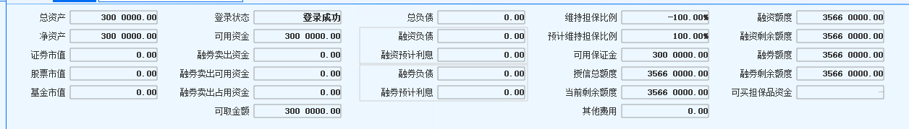
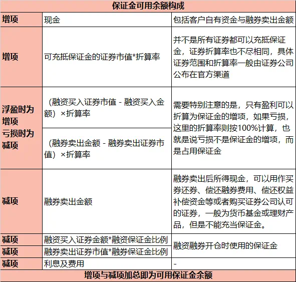

# 一文读懂融资融券

## 基本概念

* 融资融券交易(securities margin trading)：融资融券业务是指证券公司向客户出借资金供其买入证券或出借证券供其卖出证券的业务，分为融资交易和融券交易两种类型。融资交易是指客户向证券公司借资金买证券，而融券交易是指客户向证券公司借证券卖出。
* 可冲抵保证金的证券和折算率：信用户操作担保品买入的标的，通常也叫担保品标的。在冲抵保证金的时候担保品买入的证券市值要乘以对应证券的折算率。信用账户里的自有现金也是保证金，自有现金的折算率为100%。
* 担保品划转：普通户和信用户之间可以做担保品证券划转。现金需要先从账户A银证转账到银行卡后再转入账户B。
* 融资标的和融资保证金比例：融资买入的证券必须在券商的融资标的范围里，每个融资标的证券都有对应的融资保证金比例。
* 融券标的和融券保证金比例：融券卖出的证券必须在券商的融券标的范围里，每个融券标的证券都有对应的融券保证金比例。
* 担保品标的、融资标的和融券标的都会在证券公司官网公布。这3类标的包含了股票、债券和基金。
* 总体逻辑就是：投资者提供保证金，才能做信用交易，交易上可以不放杠杆(只做担保品买卖)，也可以放杠杆(融资融券交易)，每笔交易都需要经过证券公司交易系统的相关事前风控才能交易成功，同时也有事中和事后风控来监控投资者信用账户的风险。

## 资金数据

信用账户的资金数据比普通账户复杂很多，下图截取了券商交易软件上的信用账户综合查询面板的资金数据。

* 总资产：指账户上所有资产相加，包括自有的现金(不包括融券卖出的金额)、自有证券(普通户划转到信用户的证券+担保品买入的证券)的市值、融资买入的证券市值、融券卖出所得资金等。
* 总负债：融资负债+融资利息+融券负债+融券利息。

* 维持担保比例 = 总资产/总负债*100%。维持担保比例＞300%时，多出的现金或证券可以划出。维持担保比例＜140%时，需要增加总资产或降低总负债，使维持担保比率高于140%，否则融资合约到期之后无法展期。若当日清算后维持担保比例＜130%，下一交易日不及时将维持担保比例提高至140%以上，将被强制平仓的风险。
* 保证金可用余额：也叫可用保证金，计算公式如下

 

> 保证金可用余额＝现金+∑（可充抵保证金的证券市值×折算率）+∑〔（融资买入证券市值-融资买入金额）×折算率〕＋ ∑〔（融券卖出金额-融券卖出证券市值）×折算率〕-∑融券卖出金额-∑融资买入证券金额×融资保证金比例-∑融券卖出证 券市值×融券保证金比例-利息及费用 
>
> 
>
> 公式中
>
> ∑〔（融资买入证券市值融资买入金额）×折算率〕、∑〔（融券卖出金额-融券卖出证券 市值）×折算率〕中的折算率是指融资买入的证券、融券卖出的证券对应的折算率，当融资买入证券市值低于融资买入金额或者融券卖出证券市值高于融券卖出金额时，折算率按 100%计算。
>
> 也就是对于这部分，融资买入和融券卖出有浮盈的时候才乘以对应证券的折算率，浮亏的情况下折算率用100%。
>
> 
>
> 融券卖出金额=融券卖出证券的数量×卖出价格
>
> 融券卖出证券市值=融券卖出证券数量×市价(最新价)，融券卖出证券数量指融券卖出后尚未偿还的证券数量

* 授信额度：简单理解，就是投资者可融入资金或融出证券的最大限额。比如授信额度是1000万，那投资者最多只能融资买入1000万市值的证券或者融券卖出1000万市值的证券。大多数证券公司的融资授信额度和融券授信额度是共用一个授信额度，比如1000万的授信额度，那融资授信额度和融券授信额度加起来不能超过1000万。可能有个别券商区分融资授信额度、融券授信额度和融资融券授信总额度。
* 可用资金：指的是信用账户里的现金部分，包含了自有现金和融券卖出资金。券商柜台可能也叫`资金可用余额`，注意和`保证金可用余额`含义完全不同。
* 可转出担保资产：即维持担保比例超过300%的那部分现金或者可冲抵保证金的担保品证券。

## 交易逻辑

### 担保品划转

可冲抵保证金范围的证券才能在普通户和信用户之间划转，划转委托可以撤单。资金划转不能直接在普通户和信用户之间进行，需要先从划出账户转出到银行，再银证转账到划入账户。

担保品证券划转和撤单时间：交易日09:30-11:30，13:00-15:00。

资金转账是实时生效。从信用账户转出资金，限定于投资者的自有资金，融券卖出的资金不可转出，同时也要满足维持担保品比例超过300%的部分才能转出的要求，具体可以参考券商柜台的`可取资金`字段。

证券划转要下一个交易日才能在划入账户里显示，划出账户里的相应证券数量被冻结，划出账户不能再卖出，但是可以把划转委托做撤单后再卖出，撤单实时生效，要撤单必须在15:00之前操作。

参考资料：

https://mp.weixin.qq.com/s/6Ok9VF0xbEEhlJcumuOevQ

https://mp.weixin.qq.com/s/mCIy5mnj5TyYFFzwvYJAlg

### 担保品买入

担保品买入是指投资者以信用账户里的自有资金买入证券的行为，也称普通买入。

担保品买入的证券必须在可冲抵保证金的证券(担保品标的)范围内，每个担保品标的有对应的折算率，在保证金可用余额计算的时候会用到。

证券公司柜台会做必要的风控检查，如果担保品买入被拒，可能是以下原因：

> * 拟买入证券不是可充抵保证金证券；
> * 可用资金不足以买入最小交易数量；
> * 当前普通买入委托下单后不符合证券公司集中度管控要求；
> * 未开通相关交易权限，如科创板、创业板；
> * 当前的风险测评结果不符合证券公司的要求，或者反洗钱不符合证券公司要求；
> * 被证券公司采取限制信用账户普通买入的管理措施。

参考资料：https://mp.weixin.qq.com/s/Gpgm_nlEdFqLdsbmfNX4Uw

### 担保品卖出

担保品卖出是指投资者卖出信用账户里的持仓证券的行为，也称普通卖出。

**只要是信用账户里的持仓，不管是自有资金买入的证券还是融资买入的证券，都可以通过担保品卖出操作来卖出。**

当担保品卖出的证券有未了结的融资负债，卖出所得资金将优先用于偿还本证券的融资负债，本证券融资负债的偿还顺序按照合约到期日由近及远的顺序逐笔偿还，剩余部分才进入到自有资金里。若卖出的证券无对应融资负债时，卖出资金直接进入到自有资金里。

参考资料：

https://mp.weixin.qq.com/s/_XwJwXLB6lZspIYi7vCB5w

https://mp.weixin.qq.com/s/_p1j9wQGxSZ4U5YAOS6SaQ

### 融资买入

融资买入是指投资者提供保证金，从券商借入资金买入证券的行为。

融资买入的证券有一定范围，通常叫融资标的，每个融资标的证券都有对应的融资保证金比例。

比如信用账户里保证金可用余额为100万，如果某个融资标的证券的融资保证金比例为80%，那可以买入100万/80%=125万市值的该融资标的证券。

T日融资买入，T日当天就可以还款，不收利息。

融资负债合约是6个月到期，投资者通常可以在合约到期前30天开始自己申请展期，每次展期后的期限也不能超过6个月。

如果融资买入被拒绝，可能是以下原因：

> * 拟融资买入证券非我司融资标的证券；
> * 可用保证金不足：剩余可用保证金不足以覆盖融资买入所需要的保证金；
> * 可用融资授信额度不足；
> * 当前融资买入委托下单后不符合证券公司集中度管控要求；
> * 维持担保品比例是否大于安全线；
> * 其它情形，比如交易所临时暂停融资买入，比如投资者未开通创业板和科创板交易权限等；

参考资料：

https://mp.weixin.qq.com/s/Gpgm_nlEdFqLdsbmfNX4Uw

https://mp.weixin.qq.com/s/g0R2_lVQQAL4QUrkQoVnPQ

https://mp.weixin.qq.com/s/yzhUwMXnl7o3JHc1kUCu4w

### 卖券还款

卖券还款是指投资者卖出信用账户里的证券持仓来归还融资负债的行为。

卖券还款可以卖出信用账户里的任何持仓，包括自有资金买入的证券和融资买入的证券。

卖券还款有2种方式：指定合约还款和非指定合约还款。

每个券商对于指定合约还款和非指定合约还款，在还款细节上有差异。具体以每家券商的规则为准，我下面列出的是常见的券商规则：

* 指定合约还款

  必须优先指定偿还本证券融资负债合约，归还后若有剩余优先归还未指定的本证券融资负债合约；再有剩余将按照负债合约归还截止日顺序归还，若合约归还截止日相同，则按合约编号顺序归还所有负债合约；

* 非指定合约还款：

  优先偿还本证券负债合约；再有剩余按照负债合约到期日由近及远顺序归还，若合约到期日相同，则按合约编号顺序归还所有负债合约；

有的券商可以给合约设置还款优先级，优先级高的先还款。有的券商默认先还款到期日在20个自然日以内的融资负债，其次才是偿还本证券负债合约，再有剩余按照负债合约到期日由近及远顺序归还，若合约到期日相同，则按合约编号顺序归还所有负债合约；

参考资料：

https://mp.weixin.qq.com/s/_p1j9wQGxSZ4U5YAOS6SaQ

https://mp.weixin.qq.com/s/Brf3_iRlloyekBn3N9YSzA

https://mp.weixin.qq.com/s/vRLtktYkoIRpPbDQKtmWmw

### 直接还款

直接还款是指投资者使用信用账户的**自有资金**直接偿还融资负债，不能用融券卖出所得资金来归还融资负债。

直接还款有2种方式：指定合约还款和非指定合约还款。

* 指定合约还款

  指定合约归还后，还有剩余的资金按照融资负债合约到期日先后顺序还款，负债合约到期日相同的，按照合约的交易委托时间的先后顺序还款。

* 非指定合约还款：

  默认即按负债合约到期日的先后顺序还款，负债合约到期日相同的，按照合约的交易委托时间的先后顺序还款。

参考资料：

https://mp.weixin.qq.com/s/ETVJUV8NlI9cNX0zyHqNnw

https://mp.weixin.qq.com/s/_p1j9wQGxSZ4U5YAOS6SaQ

https://mp.weixin.qq.com/s/Brf3_iRlloyekBn3N9YSzA

https://mp.weixin.qq.com/s/98Ykw_EOqKsMEWsS4mUJ5A

### 融券卖出

融券卖出是指投资者从证券公司借入证券卖出的行为。

融券卖出的证券必须是融券标的，每个融券标的证券有对应的融券保证金比例。

比如保证金可用余额是100万，某个融券标的证券的融券保证金比例是80%，那就可以融券卖出100万/80%=125万市值的该融券标的证券。

T日融券卖出，T+1日才能还券，至少收1天券息。

融券卖出如果被拒，可能是以下原因导致：

> * 融券卖出的证券不是融券标的
> * 保证金可用余额不足
> * 授信额度不够
> * 要融券卖出的证券的券源数量不够

融券卖出有价格限制，融券卖出的申报价格不得低于该证券的最新成交价；当天没有产生成交的，不得低于其前收盘价，低于上述价格的申报为无效申报，会被拒单。

融券卖出所得资金，按照交易所的规定，这部分资金并不属于客户自有资金，而是具有特殊用途的资金。买券还券时，优先使用融券卖出所得资金，不足部分再使用自有可用资金。

融券卖出所得资金出了用于买券还券，还可以购买证券公司现金管理产品、货币市场基金、债券ETF基金以及券商认可的其它高流动性证券。

买入货币基金或债券ETF时优先使用投资者信用账户融券卖出所得资金，后使用信用账户自有资金；

卖出货币基金或债券ETF时优先卖出自有资金购买的部分，后卖出融券卖出所得资金购买的部分。

融券负债合约展期对于普通融券和专项融券不一样，详情可以参考：

https://mp.weixin.qq.com/s/n6CDoXpJhqJFRRIVkAEMug

参考资料：

https://mp.weixin.qq.com/s/LExJ7p6SB14s9LTjU30FvA

https://mp.weixin.qq.com/s/Mvt7WWiPRXbeSdP65qTojw

https://mp.weixin.qq.com/s/Qw_egn1vraCleSLcAoV7sg

https://mp.weixin.qq.com/s/HySkMxyqyURkLkm1vRXGbA

### 买券还券

买券还券是指投资者通过信用账户买入证券后直接归还证券公司，优先使用融券卖出资金来做买券还券，不足部分再用自有资金。

T日融券卖出，T+1日才能还券，至少收1天券息。

买券还券的偿还顺序是以合约到期日为准，优先偿还先到期的融券负债合约。

T日投资者还券数量多于融券数量，T+1交易日证券公司会将多还的证券划转到投资者的信用证券账户，T+2交易日投资者可卖出这部分多余的证券。

举个例子，投资者当前持有万科融券合约数量190股，由于买券还券只能买入整数股，可以导致投资者买券还券了200股，那多还的10股会在T+1日划转投资者信用证券账户，T+2日投资者可以操作卖出这10股万科股票。

参考资料：

https://mp.weixin.qq.com/s/UY1S3B-2ayHngjLU8-IbOw

https://mp.weixin.qq.com/s/rWKH9aAP1ncG1YfW290WFQ

### 直接还券

直接还券是指投资者使用信用账户中与负债证券相同的证券直接归还证券公司。

T日融券卖出，T+1日才能还券，至少收1天券息。

直接还券的来源一定是自有的可用证券，融资买入证券在未了结融资负债前不属于自有的可用证券，不能用于归还融券负债。

直接还券的偿还顺序是以合约到期日为准，优先偿还先到期的融券负债合约。

参考资料：

https://mp.weixin.qq.com/s/UY1S3B-2ayHngjLU8-IbOw

### 维持担保品比例

维持担保品比例=总资产/总负债。维持担保品比例越高，表示账户风险越小。

证券公司针对维持担保品比例的数值划定了4条重要的线，提取线证券公司通常都是300%，但是警戒线、平仓线、紧急平仓线不同证券公司可能有点细微差别。

* 提取线：300%。超过300%时，投资者可以从信用账户转出现金或者可冲抵保证金证券，转出后维持担保品比例也必须>=300%。

* 警戒线：不同证券公司不一样，常见的有150%，145%，140%。日终信用账户维持担保品比例低于警戒线时，证券公司会发出通知提醒投资者注意账户风险，投资者可酌情追加保证金。请注意在此情形下为控制投资者账户风险，证券公司可以限制投资者部分交易。
* 平仓线/追保线：比较常见的是130%。日终信用账户维持担保品比例低于平仓线时，信用账户将进入追保状态，且被限制担保品买入、融资买入、融券卖出等操作。若追保失败，信用账户可能面临强制平仓。
* 紧急平仓线/最低线：120%，110%。日终信用账户维持担保品比例低于紧急平仓线时，证券公司可以在下一个交易日启动强制平仓。

参考资料：

https://mp.weixin.qq.com/s/T4G-Tq4IGiNSedpQCJbwuw

https://mp.weixin.qq.com/s/4quHKnPnQevJzCiyM5gp3w

### 集中度

## 闲置资金理财

投资者往往熟悉普通账户的余额理财，比如类似于收盘之后自动转入理财的类似产品，可以极大化提高资金使用率，增厚资金余额收益。

但是信用账户目前尚不支持交易国债逆回购、货币基金申赎等业务，首先考虑将信用账户产生的沉淀资金大于维保300%部分通过银证转账转出，然后再转入到普通账户去参与盘后理财、逆回购等业务；其次剩余部分资金可以在信用账户买入场内流动性较好的货币ETF；当然客户还可以归还相应负债，来减少利息支出。

## 交易技巧

* 最大化杠杆

  先融资买入或融券卖出，再担保品买入。

* 偿还负债

  担保品卖出 vs 卖券还款。

参考资料：

https://mp.weixin.qq.com/s/u68oiLo7bYTfucuOBa07_A

## 注意事项

* 信用账户不能交易国债逆回购。
* 信用账户新股申购，需要再普通账户保留沪深两个市场股票各100股。

## 常见疑问

* 担保物和可冲抵保证金证券区别？

  只要是在信用户里的资产，无论现金还是证券，全都是担保物。

  监管规定：证券公司向客户收取的保证金、客户融资买入的全部证券和融券卖出所得的全部价款，整体作为客户对证券公司融资融券所生债务的担保物。

  此外，还有“其他担保物”，是指维持担保比例低于平仓线时，客户提交的除现金、证券外的其他担保物，但要经证券公司认可。

  **所以担保物不一定是可冲抵保证金的证券，但是持仓里的可冲抵保证金证券一定是担保物。**

* 融资买入的证券能作为保证金么？

  不能

* 融券卖出的资金能用于担保品买入么？能转出到银行卡么？

  不能

* 融券卖出的资金能用于偿还融资负债么？

  不能

* 

## References

* 国金证券融资融券投资者教育：https://mp.weixin.qq.com/s/Q8rpKDyUUBmv2g9jv0ZdtA
* 国泰君安融资融券网站：https://www.gtja.com/content/margintrade/process/case-intro.html
* 中金财富融资融券网站：https://www.ciccwm.com/ciccwmweb/stock_business/margin_requirement/margin_requirement_nav.html