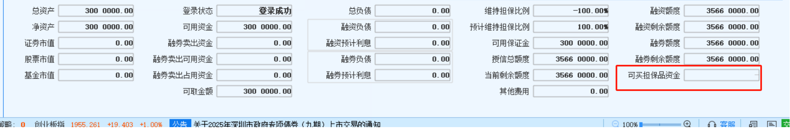

# 场内融资融券交易规则

## 基本概念

* 融资融券交易(securities margin trading)：又称“证券信用交易”或保证金交易，是指投资者向具有融资融券业务资格的证券公司提供担保物，借入资金买入证券（融资交易）或借入证券并卖出（融券交易）的行为。
* 担保品划转：普通户和信用户之间可以做担保品划转。
* 可冲抵保证金的证券和折算率：信用户做担保品买卖的标的，在冲抵保证金的时候证券市值%
* 融资标的和融资保证金比例
* 融券标的和融券保证金比例

## 资金数据

* 总资产：指账户上所有资产相加，包括自有证券(普通户划转到信用户的证券+担保品买入的证券)的市值、自有的现金、融资买入的证券市值、融券卖出后的资金等。
* 总负债：融资负债+融资利息+融券负债+融券利息。

* 维持担保比例 = 总资产/总负债*100%。维持担保比例＞300%时，多出的现金或证券可以划出。维持担保比例＜140%时，需要增加总资产或降低总负债，使维持担保比率高于140%，否则融资合约到期之后无法展期。若当日清算后维持担保比例＜130%，下一交易日不及时将维持担保比例提高至140%以上，将被强制平仓的风险。
* 保证金可用余额：也叫可用保证金

 

> 保证金可用余额＝现金+∑（可充抵保证金的证券市值×折算率）+∑〔（融资买入证券市值-融资买入金额）×折算率〕＋ ∑〔（融券卖出金额-融券卖出证券市值）×折算率〕-∑融券卖出金额-∑融资买入证券金额×融资保证金比例-∑融券卖出证 券市值×融券保证金比例-利息及费用 
>
> 
>
> 公式中
>
> ∑〔（融资买入证券市值融资买入金额）×折算率〕、∑〔（融券卖出金额-融券卖出证券 市值）×折算率〕中的折算率是指融资买入的证券、融券卖出的证券对应的折算率，当融资买入证券市值低于融资买入金额或者融券卖出证券市值高于融券卖出金额时，折算率按 100%计算。
>
> 也就是对于这部分，融资买入和融券卖出有浮盈的时候才乘以对应证券的折算率，浮亏的情况下折算率用100%。
>
> 
>
> 融券卖出金额=融券卖出证券的数量×卖出价格
>
> 融券卖出证券市值=融券卖出证券数量×市价(最新价)，融券卖出证券数量指融券卖出后尚未偿还的证券数量

* 可转出担保资产：即维持担保比例超过300%的那部分市值，即指可以转出融资融券账户的市值。
* 授信额度：
* 下单事前风控包含了授信额度和保证金可用余额的检查，维持担保比例是事中和事后风控。

## 交易逻辑

## 闲置资金理财

投资者往往熟悉普通账户的余额理财，比如类似于收盘之后自动转入理财的类似产品，可以极大化提高资金使用率，增厚资金余额收益。

但是信用账户目前尚不支持交易国债逆回购、货币基金申赎等业务，首先考虑将信用账户产生的沉淀资金大于维保300%部分通过银证转账转出，然后再转入到普通账户去参与盘后理财、逆回购等业务；其次剩余部分资金可以在信用账户买入场内流动性较好的货币ETF；当然客户还可以归还相应负债，来减少利息支出。

## 交易技巧

* 最大化杠杆

* 偿还负债

  

## 注意事项

* 融券卖出可用资金只能买券商指定的货币基金或债券基金。
* 信用账户不能交易国债逆回购。

## References

* 国金证券融资融券投资者教育：https://mp.weixin.qq.com/s/Q8rpKDyUUBmv2g9jv0ZdtA
* 国泰君安融资融券网站：https://www.gtja.com/content/margintrade/process/case-intro.html
* 中金财富融资融券网站：https://www.ciccwm.com/ciccwmweb/stock_business/margin_requirement/margin_requirement_nav.html
* 深交所融资融券交易规则2023年版本：http://docs.static.szse.cn/www/index/listing/rule/W020230217568325595241.pdf